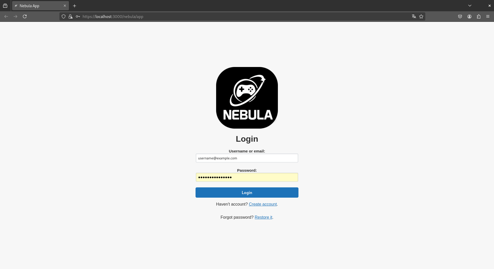

# Nebula Front App

<div align="left">


  


📄 Changelog: [Changelog](src/documentation/CHANGELOG.md)  
🔗 Repository: [GitHub - Nebula Front App](https://github.com/szymonderleta/nebula-front-app-public)   
🛠️ Jenkins Pipeline: N/A

</div>

## Overview

This application is built using React and provides a robust platform for users to manage their profiles, interact with
real-time features, and use modern web functionalities. With a responsive design, secure login, multilingual
capabilities, and an admin panel, it supports user functionalities.

## Features

* **User Registration From:** Intuitive registration form for new users.
* **User Login:** Secure login form with validation.
* **Password recover:** Password recovers form for user.
* **Account confirms:** Account confirmation page for new or unlocked accounts.
* **Redirect Route** Routing mechanism for navigation to other apps or external modules
* **Main Page** Displays available games content and allows redirect to target game.
* **Profile Page** Displays profile and allows change data and user avatar.
* **User settings** Allows change settings like volume or current theme.
* **Achievements Display:** View and celebrate user achievements.
* **Password change:** Logged-in users can change their password.

### Other Features

* **Dynamic Theme Support:** Switch between multiple theme modes for a personalized experience.
* **Image Upload:** Upload images via drag-and-drop functionality or a dedicated button.
* **Game App Redirections:** Seamlessly navigate to related game applications.
* **Profile Updates:** Update profile information and modify user settings.
* **Secure Authentication:** Login and JWT-based secure token storage in cookies.
* **Responsive Design** 

### Preview 

Here is a visual preview of key application interfaces:

<table>
  <tr>
    <td align="center">
      <br/>
      <sub>Registration Form</sub>
    </td>
    <td align="center">
      <br/>
      <sub>Login Form</sub>
    </td>
    <td align="center">
      <br/>
      <sub>Main Page</sub>
    </td>
  </tr>
  <tr>
    <td align="center">
      <br/>
      <sub>Dynamic Theme</sub>
    </td>
    <td align="center">
      <br/>
      <sub>User Settings</sub>
    </td>
    <td align="center">
      <br/>
      <sub>Responsive Page</sub>
    </td>
  </tr>
</table>

## Getting Started

1. Clone the repository:
   ```bash
   git clone https://github.com/szymonderleta/nebula-front-app-public.git
   ```
2. Navigate to the project directory:
   ```bash
   cd nebula-front-app-public
   ```
3. Install the dependencies:
   ```bash
   npm install
   ```
4. Start the development server:
   ```bash
   npm start
   ```
## Folder Structure

```
preview/               # UI screenshots
public/                # app icons and index.html
src/
├── api/                # api model, connetions to nebula rest api
├── data/               # data layer for local and session storage, app passwords and user avatar
├── resource/           # app resources, icons and css styles and themes
├── singles/            # Singleton patterns, currently implemented for handling Avatar and Theme
├── test/               # For test cases - unit, integration and examples from REST API
├── util/               # Utility classes used across components and methods
├── view/               # Components, pages, subpages and route models
└── App.js              # Main app file
ssl/                    # Stores certificate and key files for HTTPS localhost
.env                    # Stores React environment variables
```

### .env File

This file contains environment variables used to configure the application:

```ini
HTTPS=true
SSL_CRT_FILE=./ssl/localhost.crt        # Path to SSL certificate for HTTPS
SSL_KEY_FILE=./ssl/localhost.key        # Path to SSL key file for HTTPS
# REACT_APP_REQUEST_URL=https://localhost:8081/api/v1
REACT_APP_REQUEST_URL=https://milkyway.local:8555/nebula-rest-api/api/v1  # API endpoint
REACT_APP_USERNAME=nebula               # Default username for API authentication
REACT_APP_PASSWORD=4354gfdbfdg5756756765lkj65l4kj6p34o958i49p45h            # Default password for API authentication
```

## Issuses

Image is uploaded on server side, but sometimes it is not refreshed in the front page

## Future Goals / Planned Features

 - Update Main Page Game Layout  
 - Rewrite unit tests

## License

Nebula Front App is licensed under the Apache License 2.0: https://www.apache.org/licenses/LICENSE-2.0

The Nebula logo and Nebula menu logo were created with the assistance of ChatGPT.

Icons used in the application are sourced from https://game-icons.net/ and are licensed under Creative Commons BY 3.0: https://creativecommons.org/licenses/by/3.0/
